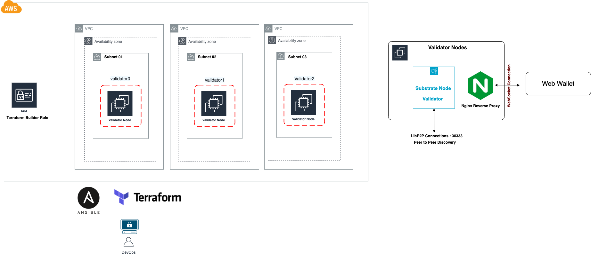
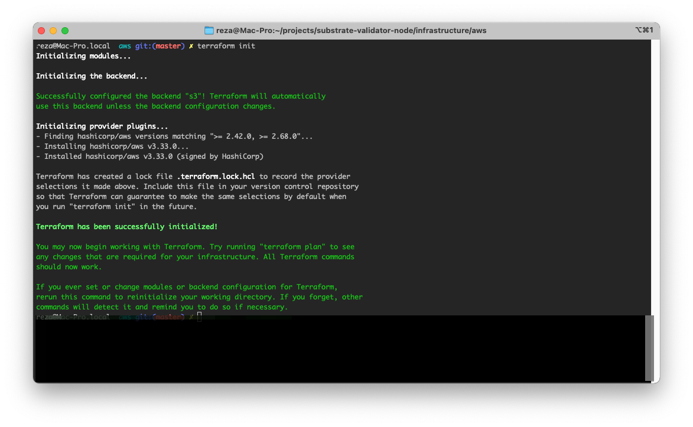
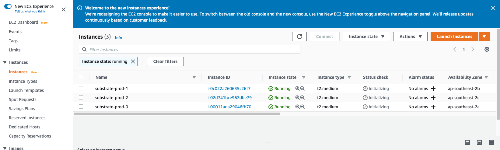
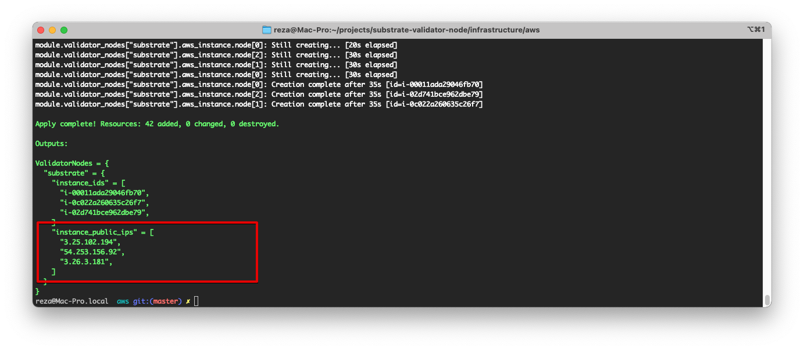
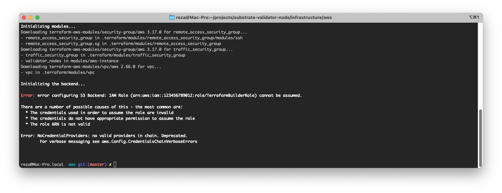

# AWS Infrastructure for Substrate Nodes

## Tables of Contents
- [AWS Infrastructure for Substrate Nodes](#aws-infrastructure-for-substrate-nodes)
  - [Tables of Contents](#tables-of-contents)
  - [Architecture](#architecture)
  - [Creating an SSH Key Pair for User Authentication](#creating-ssh-keys)
  - [Terraform Role and Access to AWS Cloud Infrastructure](#terraform-role-and-access-to-aws-cloud-infrastructure)
  - [Managing Terraform Session](#managing-terraform-session)
    - [Remotely: AWS Bucket for S3 as Backend](#remotely-aws-bucket-for-s3-as-backend)
    - [Locally: Terraform State on your Machine  `Not Recommended for Production`](#locally-terraform-state-on-your-machine--not-recommended-for-production)
  - [Managing Terraform Configuration Parameters](#managing-terraform-configuration-parameters)
  - [Pre-Deployment Check](#pre-deployment-check)
  - [Deploying Infrastructure](#deploying-infrastructure)
        - [Step 1: Initialize (Initialize Terraform Modules and Backend)](#step-1-initialize-initialize-terraform-modules-and-backend)
        - [Step 2: Deploy the Infrastructure](#step-2-deploy-the-infrastructure)
  - [Next Step](#next-step)
  - [References](#references)


## Architecture
This repository only deploy to One [AWS Region](https://aws.amazon.com/about-aws/global-infrastructure/regions_az/) at the moment.
However multi-region approach can be achieved by cloning this repo and passing different region to the terraform to build 
in desired location.



The automation is capable of distributing the nodes into different availability zone to avoid single point of failure scenarios. 

## Creating an SSH Key Pair for User Authentication
Accessing your validator nodes can be done using SSH remote service. However you need to import your access key at the time 
of creating instances. Following the instruction you can generate your own ssh key and later on add them to your infrastructure
automation code.

```bash

ssh-keygen -m PEM -t RSA -C YOUR-EMAIL-ADDRESS -f SSH_KEY_FILE_FULL_PATH

e.g.

ssh-keygen -m PEM -t RSA -C me@example.com -f /tmp/mysshkey_rsa.rsa


```
There will be two file under the location you have specified: Private and Public Key files

```bash

ssh-keygen -m PEM -t RSA -C me@mydomain.com -f /tmp/test_rsa.rsa

ls -rtl /tmp/

-rw-r--r--  1 user  wheel  2455 26 Mar 16:17 test_rsa.rsa       <--- Private 
-rw-r--r--  1 user  wheel   572 26 Mar 16:17 test_rsa.rsa.pub   <--- Public
 
```

The public key is needed for the next steps.

<b>Note:</b>
You might need to set the Key permissions to make it more restricted, Otherwise you might get a warning like this, when 
trying to ssh to any validator nodes or adding the key to your SSH agent. 

```terraform
@@@@@@@@@@@@@@@@@@@@@@@@@@@@@@@@@@@@@@@@@@@@@@@@@@@@@@@@@@@
@         WARNING: UNPROTECTED PRIVATE KEY FILE!          @
@@@@@@@@@@@@@@@@@@@@@@@@@@@@@@@@@@@@@@@@@@@@@@@@@@@@@@@@@@@
Permissions 0644 for '/tmp/test_rsa.rsa' are too open.
It is required that your private key files are NOT accessible by others.
This private key will be ignored.
```

To fix the above issue, run the following command:

```bash

chmod 400 /tmp/test_rsa.rsa

```


## Terraform Role and Access to AWS Cloud Infrastructure
To access AWS Cloud resources and build our infrastructure, we need credentials. These credentials also known as IAM Credentials.
In most scenarios (which I have seen before) people create an [IAM User](https://docs.aws.amazon.com/IAM/latest/UserGuide/id_users_create.html)
and assign full permissions (a.k.a Administrator) to it. However AWS Cloud best practices do not recommend this approach,
so I have decided to follow AWS Least Privilege Access and allow using IAM Roles in this project.

To help you out, I have created the following repository [iam-role-for-terraform](https://github.com/rezamtbcp/iam-role-for-terraform)
you will see how to setup and create an IAM User and Role for your terraform project. Which is one time work and can be used for
any other terraform projects as well.

Once you have your IAM User and Role created and ready, don't forgot to update the following Terraform configuration:

```bash

variable "iam_role_arn" {
  description = "AWS Role ARN for Deploying IaaC Code"
  type        = string
}

```

There is one more thing to do, we need to let Terraform [AWS Provider](https://registry.terraform.io/providers/hashicorp/aws/latest/docs) knows how to access credentials using one of the following methods:

[Environment Variables](https://registry.terraform.io/providers/hashicorp/aws/latest/docs#environment-variables)

You can provide your credentials via the `AWS_ACCESS_KEY_ID` and `AWS_SECRET_ACCESS_KEY`, environment variables, representing
your AWS Access Key and AWS Secret Key, respectively.

```terraform
export AWS_ACCESS_KEY_ID="YOUR KEY"
export AWS_SECRET_ACCESS_KEY="YOUR SECRET ACCESSKEY"
export AWS_DEFAULT_REGION="ap-southeast-2"

```

[Shared Credentials File](https://registry.terraform.io/providers/hashicorp/aws/latest/docs#shared-credentials-file) `Recommended`

You can use an [AWS credentials or configuration file](https://docs.aws.amazon.com/cli/latest/userguide/cli-configure-files.html) to specify your credentials.
The default location is `$HOME/.aws/credentials` on Linux and macOS, or `"%USERPROFILE%\.aws\credentials" `on Windows.

```terraform
# Make sure the following file exists and contains your credentials

$HOME/.aws/credentials

[default]
aws_access_key_id = ACCESS KEY
aws_secret_access_key = YOU SECRET ACCESS KEY

```

## Managing Terraform Session
Terraform needs to store your managed infrastructure status and configuration either locally or remotely and to do so
each Terraform configuration can specify a backend, which defines where and how operations are performed, where state snapshots are stored, etc.
If you are not familiar with them enough, I strongly recommend you to read about them on their website which you can find some useful links in 
references section.

There are multiple options to manage state either remotely or locally.

### Remotely: AWS Bucket for S3 as Backend
You can create a S3 bucket on AWS via the management console; if you don't know how, please follow the steps on AWS Doc in 
order to create a secure s3 bucket for your terraform state.

Once you have the bucket ready, change the `backend.tf` terraform file under your project.

```terraform
# backend.tf - you can not use variables here - need to be done manually

terraform {
  backend "s3" {
    bucket = "terraform-bucket-sp-southeast-2"                        # Your bucket name
    key    = "terraform_state"                                        # Your state object name 
    region = "ap-southeast-2"                                         # Your region
    profile = "default"                                               # Your AWS Credentials Profile
    role_arn = "arn:aws:iam::12345667777:role/TerraformBuilderRole"   # Your Role ARN
  }
}


```

<B>IMPORTANT NOTE:</B> 
Make sure your bucket is not public by checking the followin settings:


### Locally: Terraform State on your Machine  `Not Recommended for Production`
If you have decided to keep the state locally, just remove the `backend.tf` from your project.


## Managing Terraform Configuration Parameters
Terraform allows us to set different settings before building our infrastructure. For example number of validator nodes or 
the region that you are interested to run your nodes.

For this step, just copy and paste the `terraform.tfvars.template` as follow and make the required adjustments. 

```terraform
cp terraform.tfvars.template terraform.tfvars

# You should be able to edit the following values - some of them are pre-populated and you can leave them as it is.

aws_region = "AWS REGION"
iam_role_arn = "AWS ROLE ARN"
public_key_path="/tmp/test_rsa.pub"
project = {
    substrate = {
      public_subnet_count  = "NUMBER OF PUBLIC SUBNET - DEFAULT TO 3",
      private_subnet_count = "NUMBER OF PRIVATE SUBNETS - DEFAULT TO 3",
      instances            = "NUMBER OF INSTANCES - DEFAULT TO 3",
      instance_type        = "INSTANCE SIZE",
      environment          = "ENVIRONMENT NAME"
    }
  }
}

```

if you remember, we have created an ssh key pair before starting our deployment. The path to the public key file (ended 
with suffix .pub) is required for `public_key_path` param.

## Pre-Deployment Check
Before deploying your infrastructure, make sure 

- You have configured your AWS Cloud Credentials including IAM User / Role and Permissions correctly
- You have correctly configured your Terraform Session and Storage
- You have created a terraform.tfvars from `terraform.tfvars.template` and setup your settings correctly.

## Deploying Infrastructure

To deploy your infrastructure, you need to run the following commands:


##### Step 1: Initialize (Initialize Terraform Modules and Backend)

```terraform

terraform init

```


##### Step 2: Deploy the Infrastructure

```terraform
# Step 2: Apply (Creating Infra)

terraform apply

```

Now you should be able to see 3 instances running in your AWS account.




## Next Step
Once the terraform successfuly deployed your infrastructure, make sure you make a note of Instance IPs running in your 
infrastructure.

You can see them in your terraform output console:

```terraform

Apply complete! Resources: 42 added, 0 changed, 0 destroyed.

Outputs:

ValidatorNodes = {
  "substrate" = {
    "instance_ids" = [
      "i-00011ada3dd9046fb70",
      "i-fe02242dd66635c26f7",
      "i-f32d230dbce9d62dbe79",
    ]
    "instance_public_ips" = [
      "12.1.1.2",
      "20.20.156.92",
      "1.26.3.181",
    ]
  }
}

```




if you like to access any of the machines above, you can use their public IP and access them via ssh protocol using your credentials
generated at the beginning of this process.

First add your ssh keys to your ssh agent running on your machine, or use `-i` when running the `ssh` command. 
```terraform
# Add your private key to your agent 
ssh-add /path/to/your/ssh/private/key

e.g.
ssh-add /tmp/test_rsa.rsa
        
        
# Check if it has been added successfully 
ssh-add -l

e.g.

ssh-add -l

3072 SHA256:pLG+yljlAjYfgK0/mHFbwl75ym6FIFf/4rELP4Qe6SU /tmp/test_rsa.rsa (RSA)

```

Now run the following `ssh` command:

```bash
ssh ubuntu@NODE_PUBLIC_IP


e.g.
ssh ubuntu@12.1.1.2


````


if you don't want to keep the infra, or you have completed your testing, just run the following command (where your terraform files are)
```terraform

# Finally: Destroy infra
terraform destroy

```

## Common Issues

### Backend Initialization Error 
When you run command `terraform init` it might fail because for error like this



- Check your `backend.tf` file and make sure the IAM ROLE ARN is correct.
- Make sure you have configured the S3 bucket and updated the `backend.tf` as well.

### SSH is Failing or Permission denied
Check you have the Private key added to your ssh agent or even the ssh agent is running. 

Also is don't forget to pass the `ubuntu` as the user, see below

```bash

ssh ubuntu@40.22.22.33

```


## References
- [Terraform State](https://www.terraform.io/docs/language/state/index.html)
- [Terraform Backend](https://www.terraform.io/docs/language/settings/backends/index.html)
- [Creating an SSH Key Pair for User Authentication](https://www.ssh.com/ssh/keygen/)